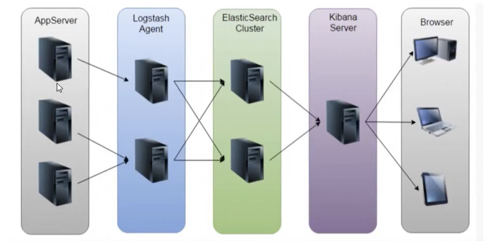
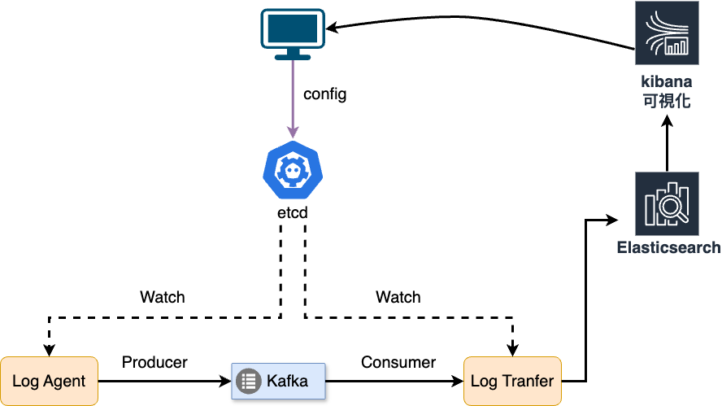
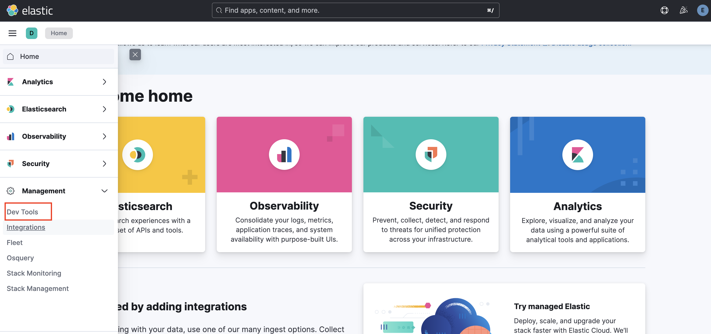
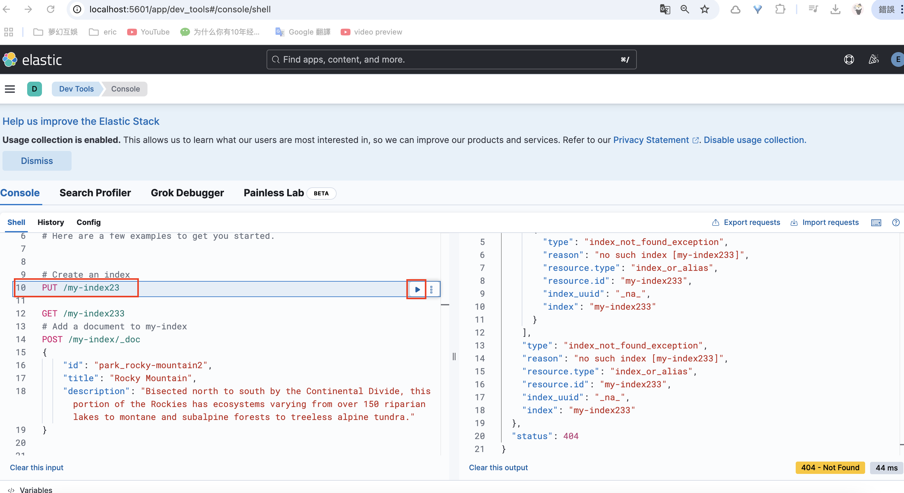

## Go 併發程式設計練手項目 - 日志收集系统
參考：
* [日誌收集專案架構設計](https://github.com/moxi624/LearningNotes/tree/master/Golang/Golang%E8%BF%9B%E9%98%B6/17_%E6%97%A5%E5%BF%97%E6%94%B6%E9%9B%86%E9%A1%B9%E7%9B%AE%E6%9E%B6%E6%9E%84%E8%AE%BE%E8%AE%A1%E5%8F%8AKafka%E4%BB%8B%E7%BB%8D)

* [日志收集系统](https://blog.csdn.net/qq_73924465/category_12643285.html)

* [Go实现LogCollect](https://blog.csdn.net/weixin_45565886/article/details/132630758?ops_request_misc=%257B%2522request%255Fid%2522%253A%252213af6ecff21c4730634ce6fd2bd36658%2522%252C%2522scm%2522%253A%252220140713.130102334..%2522%257D&request_id=13af6ecff21c4730634ce6fd2bd36658&biz_id=0&utm_medium=distribute.pc_search_result.none-task-blog-2~all~sobaiduend~default-4-132630758-null-null.142^v101^pc_search_result_base8&utm_term=go%20%E6%97%A5%E5%BF%97%E6%94%B6%E9%9B%86%E7%B3%BB%E7%BB%9F&spm=1018.2226.3001.4187)
* [go语言日志收集系统](https://blog.csdn.net/taw19960426/article/details/124559369?ops_request_misc=%257B%2522request%255Fid%2522%253A%252213af6ecff21c4730634ce6fd2bd36658%2522%252C%2522scm%2522%253A%252220140713.130102334..%2522%257D&request_id=13af6ecff21c4730634ce6fd2bd36658&biz_id=0&utm_medium=distribute.pc_search_result.none-task-blog-2~all~sobaiduend~default-2-124559369-null-null.142^v101^pc_search_result_base8&utm_term=go%20%E6%97%A5%E5%BF%97%E6%94%B6%E9%9B%86%E7%B3%BB%E7%BB%9F&spm=1018.2226.3001.4187)


### 專案背景
* 每個業務系統都有日誌，當系統出現問題時，需要透過日誌資訊來定位和解決問題。
* 當系統機器比較少時，登陸到伺服器上查看即可滿足當系統
* 當機器規模巨大，登陸到機器上查看幾乎不現實（分佈式的系統，一個系統部署在十幾台機器上）

### 解決方案
* 把機器上的日誌即時收集，統一儲存到中心系統。
* 再對這些日誌建立索引，透過搜尋即可快速找到對應的日誌記錄。
* 透過提供一個介面友善的web頁面實現日誌展示與檢索。

### 面臨的問題
* 即時日誌量非常大，每天處理數十億條。
* 日誌準即時收集，延遲控制在分鐘等級。
* 系統的架構設計能夠支援水平擴展


業界 ELK 方案

* AppServer：跑業務的伺服器
* Logstash Agent
* Elastic Search Cluster
* Kibana Server：資料視覺化
* Browser：瀏覽器

ELK 方案的問題
* 維運成本高，每增加一個日誌收集項，都需要手動修改配置
* 監控缺失，無法精準取得logstash的狀態
* 無法做到客製化開發與維護

### 日誌收集系統架構設計
* etcd ，它是用 go 寫的，是分散式統一鍵值儲存系統，可以用來做配置中心，配置共給不同節點的 server
* LogAgent 收集日誌，然後將其傳送到 Kafka 中，Kafka 既可以作為訊息佇列，也可以做到訊息的儲存元件
* 然後 Log transfer 就將 Kafka 中的日誌記錄取出來，進行處理，然後寫入到 ElasticSearch 中
* 最後將對應的日誌最後透過 Kibana 進行視覺化展示



组件介绍
* Log Agent：日誌收集客戶端，用來收集伺服器上的日誌
* Log Transfer : 日誌轉發服務，將 Kafka 中的日誌記錄取出來，進行處理，然後寫入到 ElasticSearch 中
* Kafka：高吞吐量的分散式佇列（ Linkin 開發，Apache 頂級開源專案）
* ElasticSearch：開源的搜尋引擎，提供基於 HTTP RESTful 的 web 接口
* Kibana：開源的 ES 資料分析與視覺化工具

專案用到的技能
* 服務端 Log Agent 開發
* 服務端 Log Transfer 開發
* Kafka 和 Zookeeper 的使用，用 docker compose 建立服務
* ES 和 Kibana 使用，用 docker compose 建立服務
* etcd 的使用（配置中心，配置共享），用 docker compose 建立服務
* etcd 可視化管理工具，用 docker compose 建立服務

### etcd
參考：
* [Docker Compose 部署 etcd 集群](https://oldme.net/article/32)
* [golang etcd 简明教程](https://learnku.com/articles/37343)

docker-compose.yml 模擬 3 個 etcd 節點
```
services:
  etcd1:
    image: "bitnami/etcd:latest"
    container_name: "etcd1"
    # restart: "always"
    ports:
      - 12379:12379
    environment:
      - TZ=Asia/Taipei
      # 允许无认证访问
      - ALLOW_NONE_AUTHENTICATION=yes
      # 名称
      - ETCD_NAME=etcd1
      # 列出这个成员的伙伴 URL 以便通告给集群的其他成员
      - ETCD_INITIAL_ADVERTISE_PEER_URLS=http://etcd1:2380
      # 用于监听伙伴通讯的URL列表
      - ETCD_LISTEN_PEER_URLS=http://0.0.0.0:2380
      # 用于监听客户端通讯的URL列表
      - ETCD_LISTEN_CLIENT_URLS=http://0.0.0.0:12379
      # 初始化集群记号，建议一个集群内的所有节点都设置唯一的token
      - ETCD_INITIAL_CLUSTER_TOKEN=MyEtcd
      # 列出这个成员的客户端URL，通告给集群中的其他成员
      - ETCD_ADVERTISE_CLIENT_URLS=http://etcd1:12379
      # 集群配置，格式是ETCD_NAME=ETCD_INITIAL_ADVERTISE_PEER_URLS
      - ETCD_INITIAL_CLUSTER=etcd1=http://etcd1:2380,etcd2=http://etcd2:2380,etcd3=http://etcd3:2380
      # 初始化集群状态，这里写 new 就行
      - ETCD_INITIAL_CLUSTER_STATE=new

  etcd2:
    image: "bitnami/etcd:latest"
    container_name: "etcd2"
    # restart: "always"
    ports:
      - 22379:22379
    environment:
      - TZ=Asia/Taipei
      # 允许无认证访问
      - ALLOW_NONE_AUTHENTICATION=yes # 名称
      - ETCD_NAME=etcd2
      # 列出这个成员的伙伴 URL 以便通告给集群的其他成员
      - ETCD_INITIAL_ADVERTISE_PEER_URLS=http://etcd2:2380
      # 用于监听伙伴通讯的URL列表
      - ETCD_LISTEN_PEER_URLS=http://0.0.0.0:2380
      # 用于监听客户端通讯的URL列表
      - ETCD_LISTEN_CLIENT_URLS=http://0.0.0.0:22379
      # 初始化集群记号，建议一个集群内的所有节点都设置唯一的token
      - ETCD_INITIAL_CLUSTER_TOKEN=MyEtcd
      # 列出这个成员的客户端URL，通告给集群中的其他成员
      - ETCD_ADVERTISE_CLIENT_URLS=http://etcd2:22379
      # 集群配置，格式是ETCD_NAME=ETCD_INITIAL_ADVERTISE_PEER_URLS
      - ETCD_INITIAL_CLUSTER=etcd1=http://etcd1:2380,etcd2=http://etcd2:2380,etcd3=http://etcd3:2380
      # 初始化集群状态，这里写 new 就行
      - ETCD_INITIAL_CLUSTER_STATE=new

  etcd3:
    image: "bitnami/etcd:latest"
    container_name: "etcd3"
    # restart: "always"
    ports:
      - 32379:32379
    environment:
      - TZ=Asia/Taipei
      # 允许无认证访问
      - ALLOW_NONE_AUTHENTICATION=yes # 名称
      - ETCD_NAME=etcd3
      # 列出这个成员的伙伴 URL 以便通告给集群的其他成员
      - ETCD_INITIAL_ADVERTISE_PEER_URLS=http://etcd3:2380
      # 用于监听伙伴通讯的URL列表
      - ETCD_LISTEN_PEER_URLS=http://0.0.0.0:2380
      # 用于监听客户端通讯的URL列表
      - ETCD_LISTEN_CLIENT_URLS=http://0.0.0.0:32379
      # 初始化集群记号，建议一个集群内的所有节点都设置唯一的token
      - ETCD_INITIAL_CLUSTER_TOKEN=MyEtcd
      # 列出这个成员的客户端URL，通告给集群中的其他成员
      - ETCD_ADVERTISE_CLIENT_URLS=http://etcd3:32379
      # 集群配置，格式是ETCD_NAME=ETCD_INITIAL_ADVERTISE_PEER_URLS
      - ETCD_INITIAL_CLUSTER=etcd1=http://etcd1:2380,etcd2=http://etcd2:2380,etcd3=http://etcd3:2380
      # 初始化集群状态，这里写 new 就行
      - ETCD_INITIAL_CLUSTER_STATE=new
```

在 etcd 將多個不同 log 文件設定到各個 topic ， key 為 collect_log_conf ， value 為 json 格式
```
[
    {
        "path": "log/access",
        "topic": "access.log"
    },
    {
        "path": "log/error",
        "topic": "error.log"
    }
]
```

進到 etcd1 容器
```
docker exec -it etcd1 bash
```

容器內下 etcd 指令
```
etcdctl --endpoints=localhost:12379 put [key] [value]
etcdctl --endpoints=etcd2:22379 get [key] [value]
etcdctl --endpoints=etcd3:32379 get [key] [value]
```


#### etcd 可視化管理工具

參考 
* [Etcd可视化管理工具](https://blog.csdn.net/inthirties/article/details/126741393)
* [joinsunsoft/etcdv3-browser](https://registry.hub.docker.com/r/joinsunsoft/etcdv3-browser)

docker-compose.yml
```
  etcd-ui:
    image: joinsunsoft/etcdv3-browser
    ports:
      - 8090:80
    platform : linux/amd64
```
初始帳號： ginghan

初始密碼： 123456


### kafka
docker-compose.yml
```
services:
  zookeeper:
    image: 'bitnami/zookeeper:latest'
    ports:
      - '2181:2181'
    environment:
      # 匿名登录--必须开启
      - ALLOW_ANONYMOUS_LOGIN=yes
      #volumes:
      #- ./zookeeper:/bitnami/zookeeper
      # 该镜像具体配置参考 https://github.com/bitnami/bitnami-docker-kafka/blob/master/README.md
  kafka:
    image: 'bitnami/kafka:latest'
    ports:
      - '9092:9092'
      - '9999:9999'
    environment:
      - KAFKA_BROKER_ID=1
      - KAFKA_CFG_NODE_ID=1
      # - KAFKA_CFG_PROCESS_ROLES=controller,broker
      - KAFKA_CFG_LISTENERS=PLAINTEXT://:9092
      # - KAFKA_CFG_LISTENER_SECURITY_PROTOCOL_MAP=CONTROLLER:PLAINTEXT,PLAINTEXT:PLAINTEXT
      # - KAFKA_CFG_CONTROLLER_QUORUM_VOTERS=0@kafka:9093
      # - KAFKA_CFG_CONTROLLER_LISTENER_NAMES=CONTROLLER
      - KAFKA_CFG_INTER_BROKER_LISTENER_NAME=PLAINTEXT
      # - KAFKA_CFG_ZOOKEEPER_METADATA_MIGRATION_ENABLE=true
      # 客户端访问地址，更换成自己的
      - KAFKA_CFG_ADVERTISED_LISTENERS=PLAINTEXT://localhost:9092
      - KAFKA_CFG_ZOOKEEPER_CONNECT=zookeeper:2181
      # 允许使用PLAINTEXT协议(镜像中默认为关闭,需要手动开启)
      - ALLOW_PLAINTEXT_LISTENER=yes
      # 开启自动创建 topic 功能便于测试
      - KAFKA_CFG_AUTO_CREATE_TOPICS_ENABLE=true
      # 全局消息过期时间 6 小时(测试时可以设置短一点)
      - KAFKA_CFG_LOG_RETENTION_HOURS=6
      # 开启JMX监控
      # - JMX_PORT=9999
      #volumes:
      #- ./kafka:/bitnami/kafka
    # depends_on:
      # - zookeeper
  # Web 管理界面 另外也可以用exporter+prometheus+grafana的方式来监控 https://github.com/danielqsj/kafka_exporter
  # kafka_manager 只有支援 linux/amd64
  # kafka_manager:
  #   image: 'hlebalbau/kafka-manager:latest'
  #   ports:
  #     - "9000:9000"
  #   environment:
  #     ZK_HOSTS: "zookeeper:2181"
  #     APPLICATION_SECRET: letmein
  #   depends_on:
  #     - zookeeper
  #     - kafka
  # kafka-ui:
  #   image: provectuslabs/kafka-ui
  #   container_name: kafka-ui
  #   ports:
  #     - "8082:8080"
  #   environment:
  #     - KAFKA_CLUSTERS_0_NAME=local-kafka
  #     - KAFKA_CLUSTERS_0_BOOTSTRAPSERVERS=kafka:9092
  #     - KAFKA_CLUSTERS_0_ZOOKEEPER=zookeeper:2181
  #     # - KAFKA_CLUSTERS_0_READONLY=true
  #   depends_on:
  #     - kafka
  #     - zookeeper
  Redpanda:
    image: redpandadata/console:latest
    ports:
      - "8083:8080"
    environment:
      - KAFKA_BROKERS=kafka:9092
    depends_on:
      - kafka
      - zookeeper

```


### elastic
參考
* [Elastic Stack(ELK)數據圖表化與異常監控](https://ithelp.ithome.com.tw/articles/10277263)
* [重新開始 elasticsearch](https://ithelp.ithome.com.tw/articles/10354384)

docker-compose.yml
```
services:
  elasticsearch:
    image: elasticsearch:8.17.1
    container_name: es
    ports:
      - 9200:9200
      - 9300:9300
    environment:
      - discovery.type=single-node
      - xpack.security.enabled=true
      - ELASTIC_PASSWORD=123456
      - ES_JAVA_OPTS=-Xms128m -Xmx128m # 出現 error code exit(137) 加此行
         # 開發測試用，關閉 SSL
      - xpack.security.http.ssl.enabled=false
      - xpack.security.transport.ssl.enabled=false
      # - "logger.level=DEBUG"
    networks:
      - elastic
  kibana:
    image: kibana:8.17.1
    container_name: kibana
    ports:
      - "5601:5601"
    # volumes:
    #   - ./kibana.yml:/usr/share/kibana/config/kibana.yml
    environment:
      - ELASTICSEARCH_HOSTS="http://elasticsearch:9200"
      # - XPACK_SECURITY_ENABLED=false
      # 創建一個專門的 Kibana 系統用戶
      - ELASTICSEARCH_USERNAME=kibana_system
    depends_on:
      - elasticsearch
    networks:
      - elastic
networks:
  elastic:
    driver: bridge
```

進到 elasticsearch container 內
```
docker exec -it elasticsearch bash
```
在 container 內下指令修改密碼，此為設定 kibana 專用帳號可以讓 kibana 操作 elasticsearch
```
elasticsearch-reset-password -u kibana_system -i
```
在瀏覽器打開 http://localhost:9200 ，輸入初始帳號 elastic ， 密碼會在 docker-compose.yml 內設定，登入成功後有看到字串，表示 elasticsearch 正常運行
```
{
  "name" : "41eb6d364a70",
  "cluster_name" : "docker-cluster",
  "cluster_uuid" : "i9QxvGSpRpCZFwB2A4LHCw",
  "version" : {
    "number" : "8.17.1",
    "build_flavor" : "default",
    "build_type" : "docker",
    "build_hash" : "d4b391d925c31d262eb767b8b2db8f398103f909",
    "build_date" : "2025-01-10T10:08:26.972230187Z",
    "build_snapshot" : false,
    "lucene_version" : "9.12.0",
    "minimum_wire_compatibility_version" : "7.17.0",
    "minimum_index_compatibility_version" : "7.0.0"
  },
  "tagline" : "You Know, for Search"
}
```
在瀏覽器打開 http://localhost:5601 ，輸入跟上面一樣的帳號密碼，成功登入後，表示 kibana 正常運行，點選更多選項，在 Management 下方 ，點選 Dev Tools 


Dev Tools ，可以測試 elasticsearch 的 api ，滑鼠點到預設 api 上，會出現一個播放按鈕，點擊觸發 api



### Log Agent
* 此服務端主要包含 config ini、tailf、kafka、etcd
  
* 服務端功能說明： 
  
  先透過讀取 ini 檔，設定一些 config 配置參數，EX : etcd address 、 etcd key ，接著啟動連接 etcd 服務，並監聽從 ini 取得 etcd key 為 collect_log_conf 內的值( json 格式，log 參數)
  ```
  [
    {
        "path": "log/access",
        "topic": "access.log"
    },
    {
        "path": "log/error",
        "topic": "error.log"
    }
  ]
  ```
  透過 log 參數內的日誌文件路徑，接著會類似於在 linux 下透過 tail 的方法讀取日誌文件，將讀取的內容發給 kafka，這裡的 tailf 是可以監聽日誌文件動態變化的，當日誌文件發生變化時，tailf 去取得對應的日誌動態變化，透過 kafka producer 依照前面取得 log 參數內的 topic 發送到 kafka 上， 

### Log Transfer
* 此服務端主要包含 config ini、elasticsearch、kafka、etcd
* 服務端功能說明： 
  
  先透過讀取 ini 檔，設定一些 config 配置參數，EX : etcd address 、 etcd key ，接著啟動連接 etcd 服務，從 ini 取得 etcd key 為 collect_log_conf 內的值( json 格式的字串，log 參數)
  ```
  [
    {
        "path": "log/access",
        "topic": "access.log"
    },
    {
        "path": "log/error",
        "topic": "error.log"
    }
  ]
  ```
  
  還有從 etcd 取得 key 為 elasticsearch_config 的值( json 格式， elasticsearch 連接參數)
  ```
  {
    "api_key":"elasticsearch_api_key",
    "url_address":[
      "http://localhost:9200"
    ]
  }
  ```
  然後透過該值連接 elasticsearch ，接著透過 kafka consumer 從前面取得 log 參數內的 topic ，從 kafka 上，對應依 topic 消費取得日誌內容後，透過 elasticsearch 的 api 將日誌內容寫入到 elasticsearch 

### 檔案結構 (tree 指令產生)
```
.
├── README.md       => 說明檔
├── common          => 共用的程式碼
│   └── struct.go
├── config.ini      => 設定檔
├── elk             => 操作 elasticsearch api 相關的程式碼
│   └── elasticsearch.go
├── etcd            => 操作 etcd 相關的程式碼
│   └── etcd.go     
├── go.mod
├── go.sum
├── kafka           => kafka 相關的程式碼
│   ├── consumer.go => 從 kafka 取出訊息
│   └── producer.go => 將訊息寫入 kafka
├── log_agent       => Log Agent：日誌收集客戶端，用來收集伺服器上的日誌到 kafka
│   ├── log         =>  測試的 log 檔
│   │   ├── access
│   │   │   └── access.log
│   │   ├── error
│   │   │   └── error.log
│   │   └── info
│   │       └── info.log
│   └── main.go
├── log_transfer  =>日誌轉發服務，將 Kafka 中的日誌記錄取出來，進行處理，然後寫入到 ElasticSearch 中
│   └── main.go
├── tail_file      => tail 監聽日誌文件
   └── tail.go
```

### 執行
分別在 log_transfer 跟 log_agent資料夾下的 main.go 檔，可以用 vscode 開兩個視窗各自執行

### 使用到的 golang package
<table>
<th>package</th>
<th>說明</th>
<th>操作說明</th>
<tr>
<td><a href="https://github.com/hpcloud/tail">tail</a></td>
<td>檔案有更新，tail 會自己主動刷新，確保你看到最新的檔案內容</td>
<td><a href="https://www.cnblogs.com/wind-zhou/p/12840174.html">open</a></td>
</tr>
<tr>
<td><a href="https://github.com/Shopify/sarama">sarama</a></td>
<td>操作 kafka 相關功能</td>
<td><a href="https://blog.csdn.net/ydl1128/article/details/126287035">open</a></td>
</tr>
<tr>
<td><a href="https://github.com/etcd-io/etcd">etcd</a></td>
<td>操作 etcd 相關功能</td>
<td><a href="https://www.topgoer.com/%E6%95%B0%E6%8D%AE%E5%BA%93%E6%93%8D%E4%BD%9C/go%E6%93%8D%E4%BD%9Cetcd/%E6%93%8D%E4%BD%9Cetcd.html">open</a></td>
</tr>
<tr>
<td><a href="https://github.com/etcd-io/etcd">go-elasticsearch</a></td>
<td>操作 elasticsearch 相關功能</td>
<td><a href="https://ithelp.ithome.com.tw/articles/10277263">open</a></td>
</tr>


</table>